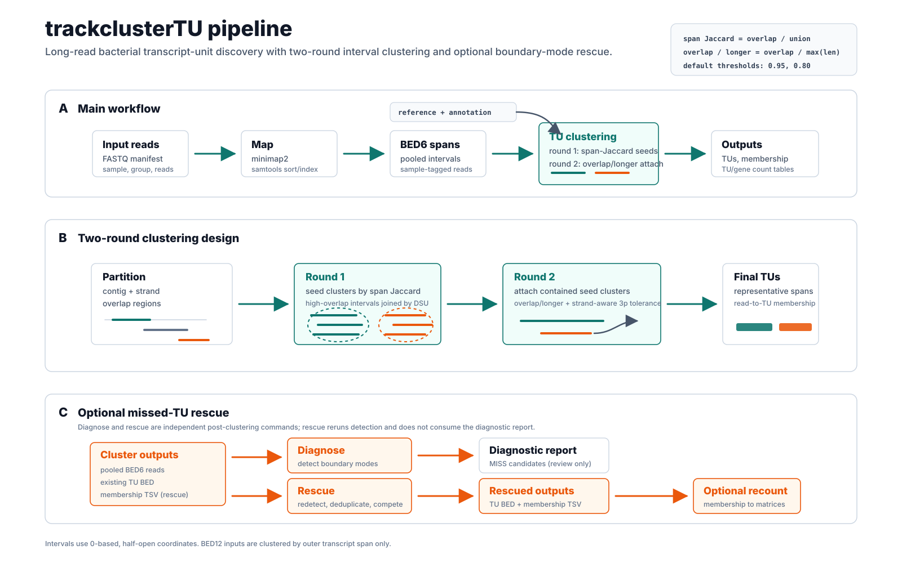

<p align="center">
  
</p>

# trackclusterTU

Fast interval similarity and scalable clustering for bacterial transcript units (TUs) from mapped long reads.

This repository ships the Rust `trackclustertu` CLI.

## Project Metadata

- Repository: [lrslab/trackclusterTU](https://github.com/lrslab/trackclusterTU)
- Distribution: GitHub Release binaries built with `cargo build --release`; this project is not published to crates.io
- Rust package: `trackclustertu`
- CLI binary: `trackclustertu`
- License: MIT

## What Is A TU Here?

For bacteria, each mapped read is treated primarily as a single genomic interval `[start, end)` using 0-based, half-open coordinates.
Reads are clustered into candidate transcript units using overlap-based similarity.
When the input is BED12, clustering intentionally uses only the outer transcript span `[tx_start, tx_end)`; exon blocks do not affect `score1` or `score2`.

### Similarity Scores

- `score1`: `overlap / union`
- `score2`: `overlap / max(lenA, lenB)`

By default, `trackclustertu cluster` and `trackclustertu run` use `score1` to form seed clusters and then use `score2` in a second pass to pool truncated molecules with their parent cluster.
That second pass is one-sided on the 3 prime end: a shorter cluster may terminate anywhere inside its parent's span but may not overhang the parent's strand-aware 3 prime end by more than `12 bp` by default; adjust it with `--three-prime-tolerance-bp`.
If you need to relax 5 prime fragmentation for near-matching reads, you can also set `--max-5p-delta` to allow merges within an explicit strand-aware 5 prime delta.
If you want to keep only the `score1` seed clusters as the final TUs, pass `--skip-score2-attachment`.

Pooled reads are then split into final consensus families. Boundary consensus is voted on only by anchor-quality members (`score1` at or above the threshold against the family anchor), while contained fragments — reads staying inside the consensus span up to a length-scaled jitter window on either end — are absorbed as members that count toward support without moving boundaries. Membership is always justified against the final consensus, never through a chain of intermediate reads, so distinct endpoint modes beyond the jitter window still split into separate TUs.

## Install

### Option 1: Download A GitHub Release Binary

Prebuilt release tarballs are published from GitHub Actions on tagged releases:

- Releases: [lrslab/trackclusterTU/releases](https://github.com/lrslab/trackclusterTU/releases)
- Release tag for this version: `v0.2.2`
- Archive naming: `trackclustertu-v0.2.2-<target>.tar.gz`
- Required checksum manifest: `SHA256SUMS`

Each archive contains the `trackclustertu` executable, `LICENSE`, and `README.md`.
The release workflow builds `x86_64-unknown-linux-musl`,
`aarch64-unknown-linux-gnu`, and `aarch64-apple-darwin` archives. Download the
archive for your target, extract it, and place `trackclustertu` somewhere on
your `PATH`. Before using the binary, verify the archive against the required
`SHA256SUMS` release asset: calculate it with `sha256sum <archive>` on Linux or
`shasum -a 256 <archive>` on macOS and compare it with the matching manifest
entry.

### Option 2: Clone And Build From Source

```bash
git clone https://github.com/lrslab/trackclusterTU.git
cd trackclusterTU
cargo build --release --locked --bin trackclustertu
```

The built executable will be:

- `target/release/trackclustertu`

To install it into Cargo's bin directory instead:

```bash
cargo install --locked --path . --bin trackclustertu
```

## External Mapping Tools

`trackclustertu map` and `trackclustertu run` require these tools to be installed and available on `PATH`:

- `minimap2`
- `samtools`

Tested versions:

- `minimap2 2.30-r1287`
- `samtools 1.22.1`

If you only use `bam-to-bed`, `gff-to-bed`, `cluster`, `recount`,
`diagnose-missed-tus`, or `rescue-missed-tus`, these external mapping tools are
not required.

Use `--minimap2` and `--samtools` to select explicit executables. Mapping always starts with the SAM-producing direct-RNA preset `-ax map-ont`; additional mapper arguments are appended with repeated `--minimap2-arg` values, which preserve OS-string and whitespace boundaries. The deprecated `--minimap2-args` compatibility form also appends values but still splits one string on whitespace.

Successful `map` and `run` commands publish `run_manifest.json` atomically. It records the effective configuration, compile-time package/Git state, canonical input paths with SHA-256 and size, library profile, thread allocation, and external tool versions without copying the process environment. GitHub release binaries embed the exact tagged commit during the build instead of inspecting a repository on the machine where the binary is run.

## Usage

Help:

```bash
trackclustertu --help
trackclustertu run --help
trackclustertu map --help
trackclustertu cluster --help
trackclustertu recount --help
trackclustertu diagnose-missed-tus --help
trackclustertu rescue-missed-tus --help
trackclustertu bam-to-bed --help
trackclustertu gff-to-bed --help
```

Docs and examples:

- `doc/README.md`
- `examples/README.md`

Quick examples:

```bash
trackclustertu cluster \
  --in reads.bed \
  --format bed6 \
  --out-dir results
```

Cluster membership uses the versioned v2 schema. Equal or near-equal biological evidence is reported as `ambiguous`, never silently resolved by TU identifier text. `--ambiguity-margin` controls the score margin (default `0.02`); `--fractional-assignment` divides each ambiguous read across qualifying candidates with weights that sum exactly to `1.0`. Every hard `unique` or `partial` assignment contributes weight `1` to `fractional_count`; enabled ambiguous fractions are added to those hard weights. Count files distinguish unique, full-length-evidence, hard total, and fractional counts. See [`doc/output_directory.md`](doc/output_directory.md) for the exact columns and sample/group semantics.

With `--annotation-bed`, gene relationships require at least one overlapping base by default. Tighten that policy with `--gene-min-overlap-bp`, `--gene-min-tu-fraction`, and `--gene-min-gene-fraction`. `tu_semantics.tsv` records same-strand genes in transcription direction and deterministic multi-label classifications:

- `alternative_start`: another TU has the same non-empty ordered gene context and 3-prime boundary but a different 5-prime boundary;
- `alternative_termination`: the corresponding same-context 5-prime boundary is shared but the 3-prime boundary differs;
- `readthrough`: at least two same-strand genes pass the overlap policy;
- `antisense`: at least one opposite-strand gene passes it;
- `intergenic`: no gene on either strand passes it; and
- `probable_processing_product`: the TU is strictly contained in a longer TU with the same non-empty context and both boundaries are internal.

Labels are emitted in that fixed order and may coexist; a TU with none is `canonical`. `tus.gff3` contains 1-based GFF3 transcript features and child `gene_overlap` relationships. TU IDs are coordinate-derived by default (`TUg_<hex-contig>_<start>_<end>_<p|m>`), so filtering another TU does not renumber them. Coordinate-identical final consensus families are coalesced before IDs are assigned, making these stable IDs unique within a run. Use `--tu-id-style sequential` for the historical serial IDs; `tu_id_map.tsv` always makes emitted, stable, and sequential identities auditable.

Gene counts are deliberately nonexclusive: one polycistronic/readthrough TU contributes its complete assignment weight to every qualifying same-strand gene. Consequently, summed gene counts can exceed read and TU totals. Antisense relationships are reported but are not added to gene counts; each gene count file/matrix carries this policy in `#count_semantics` metadata. In `tus.anchored.bed12`, blocks and `gene_list` use only qualifying same-strand genes. A TU with no such gene is emitted as one full-TU block with `gene_list=.` even if it has an antisense relationship.

```bash
trackclustertu cluster \
  --manifest samples.bed.tsv \
  --format bed6 \
  --annotation-bed genes.bed \
  --out-dir results
```

```bash
trackclustertu recount \
  --manifest samples.bed.tsv \
  --pooled-membership results/membership.tsv \
  --out-dir recount_results
```

`recount` needs no individual output options. It defaults `tu_count.csv`,
`tu_sample_long.tsv`, and `tu_sample_matrix.tsv` into `--out-dir`, plus
`tu_group_matrix.tsv` when groups exist; individual `--out-*` options override
those paths. If `--out-dir` is also omitted, it uses the manifest-derived
`<manifest-stem>.trackclustertu/` directory.

```bash
trackclustertu gff-to-bed \
  --annotation-gff genes.gff3 \
  --out-bed genes.bed
```

```bash
trackclustertu bam-to-bed \
  --in-bam sample.sorted.bam \
  --out-bed sample.bed
```

When `--out-evidence` is enabled, a fully read BAM block whose payload cannot be
decoded is skipped, counted as `malformed_record`, and written as an evidence
placeholder before conversion continues. Truncated records, BGZF/I/O damage,
and invalid declared coordinate order remain fatal because safe recovery cannot
be guaranteed. Mapped records without a usable read name are also filtered and
recorded instead of being emitted with the placeholder ID `.`. Boundary-support
two-pass conversion fingerprints the header and every record in both passes and
fails if the input changes before publication.

In manifest mode, `bam-to-bed --emit-evidence` writes an `evidence` path into
`samples.bed.tsv`. A later `cluster --manifest samples.bed.tsv` validates each
retained evidence row against the BED read ID, coordinates, and strand, then
propagates `effective_full_length` into membership and TU/sample/group counts.
Manifests without an evidence column retain the historical behavior: their BED
reads are not assumed to be full length.

```bash
trackclustertu diagnose-missed-tus \
  --in sample.bed \
  --existing-tu results/tus.bed \
  --annotation-bed genes.bed \
  --out-tsv results/missed_tus.tsv \
  --out-bed results/missed_tus.bed
```

`diagnose-missed-tus` groups reads into strand-aware 3 prime end families, finds high-support 5 prime modes within each family, and reports candidate intervals that are not represented by the current TU BED. Report identifiers use the `MISS####` namespace.

```bash
trackclustertu rescue-missed-tus \
  --in sample.bed \
  --existing-tu results/tus.bed \
  --existing-membership results/membership.tsv \
  --annotation-bed genes.bed \
  --out-tu rescue/rescued.tus.bed \
  --out-membership rescue/rescued.membership.tsv \
  --out-tu-count rescue/rescued.tu_count.csv \
  --out-candidates-tsv rescue/rescued_candidates.tsv
```

`diagnose-missed-tus` and `rescue-missed-tus` are independent commands over the
same original cluster inputs: rescue does not consume the diagnostic report.
It reruns boundary-mode detection, deduplicates nearby modes, applies support
filters before and after read competition, and then emits the surviving calls.
For each retained read, rescue compares strand-aware boundary quality in this
order: smaller 3-prime delta, smaller 5-prime delta, then higher mode support.
The existing comparison target is only the read's current hard TU assignment;
its comparison support is `0`, so boundary-delta ties favor a supported mode.
When there is no hard assignment, a supported rescue candidate is eligible for
promotion. Ties that do not beat the hard TU remain unchanged.

Legacy membership input remains four-column legacy output. For retained reads,
membership-v2 rows not promoted by rescue retain their status, candidate,
fractional, and full-length-evidence fields, while promoted v2 rows become
canonical `unique` assignments to the rescued TU and retain their
full-length-evidence flag. Mixed legacy/v2 input and the earlier six-column v2
form are accepted; untouched rows keep their original representation and
width. Homogeneous v2-bearing output uses `#columns`; homogeneous legacy-only
output does not gain a synthesized schema header. Heterogeneous output uses
`#row_widths` plus width-specific column declarations and explicit legacy/short
v2 presence flags. For v2-bearing output, `#rescue_*` metadata records the
unchanged-row, promoted-row, and hard-count semantics. Reads quarantined during
rescue parsing, deduplication, or filtering are not retained in the rescued
membership.

The rescued TU BED keeps every existing TU, including TUs with zero final hard
assignments. Rescued TU IDs use `RESC####` by default (configurable with
`--rescue-prefix`), in a namespace distinct from the report-only `MISS####`
IDs. The rescue candidate TSV links them explicitly with `rescued_tu_id` and
reports the final promoted-read count as `rescued_hard_count`; the candidate
BED name also contains both identifiers. Candidate `mode_support` remains
detector support before final competition. `--out-tu-count` is the authoritative
two-column `tu_id,count` hard-assignment table for this command and may contain
zeroes; it is intentionally different from the six-column cluster/recount TU
count table.

## Recommended Default Workflow: Cluster Then Rescue

`trackclustertu run` stops after the main clustering and count outputs. The missed-TU rescue stage is a separate post-clustering pass.

The current built-in defaults in code are:

- clustering: `--score1-threshold 0.95`, `--score2-threshold 0.80`, `--three-prime-tolerance-bp 12`
- diagnose/rescue: `--three-prime-window-bp 12`, `--max-three-prime-family-diameter-bp 12` (defaults to the 3-prime window), `--five-prime-window-bp 10`, `--min-family-support 20`, `--min-mode-support 20`, `--min-mode-fraction 0.02`, `--max-candidates-per-family 3`; `--min-read-len` is unset
- rescue naming: `--rescue-prefix RESC`

These are compatibility defaults, not a claim of biological optimality. Validate thresholds for the organism, library chemistry, mapping protocol, and biological question used in each analysis.

For a single BED6 input, the recommended default walkthrough is:

```bash
trackclustertu cluster \
  --in reads.bed \
  --format bed6 \
  --annotation-bed genes.bed \
  --out-dir results
```

```bash
trackclustertu diagnose-missed-tus \
  --in reads.bed \
  --existing-tu results/tus.bed \
  --annotation-bed genes.bed \
  --out-tsv rescue/missed_candidates.tsv \
  --out-bed rescue/missed_candidates.bed
```

```bash
trackclustertu rescue-missed-tus \
  --in reads.bed \
  --existing-tu results/tus.bed \
  --existing-membership results/membership.tsv \
  --annotation-bed genes.bed \
  --out-tu rescue/rescued.tus.bed \
  --out-membership rescue/rescued.membership.tsv \
  --out-tu-count rescue/rescued.tu_count.csv \
  --out-candidates-tsv rescue/rescued_candidates.tsv \
  --out-candidates-bed rescue/rescued_candidates.bed
```

For manifest-based clustering, use `results/pooled.bed` as the `--in` file for `diagnose-missed-tus` and `rescue-missed-tus`, because that is the BED6 track that was actually clustered.

Rescue requires unique, non-empty TU IDs in `--existing-tu` and unique read IDs
in `--existing-membership`. Every membership read ID must occur in the BED6
input, and every hard, best, second, or fractional TU reference must resolve to
the existing TU BED. Individual invalid or duplicate BED reads are quarantined;
membership rows for reads not retained after that step are not copied to the
rescued membership.

If you need updated sample/group count tables after rescue, rerun `recount` from the rescued membership TSV:

```bash
trackclustertu recount \
  --manifest mapped/samples.bed.tsv \
  --pooled-membership rescue/rescued.membership.tsv \
  --out-dir rescue/recount
```

`recount` derives its TU universe from hard, best, second, and fractional TU
references in the membership file; it does not read the rescued TU BED. An
existing zero-count TU that is not referenced anywhere in membership therefore
remains in `rescue/rescued.tu_count.csv` but does not appear in recount matrices.

## Full Pipeline



Supported workflow:

`FASTQ -> sorted BAM -> BED6 -> TU clustering -> TU/gene counts`

### Step 1: Prepare A Sample Manifest

```tsv
sample	group	reads
sampleA	control	data/sampleA.fastq.gz
sampleB	treated	data/sampleB.fastq.gz
```

- `sample` is required
- `reads` is required
- `group` is optional

Relative `reads` paths are resolved relative to the manifest file.
The separator `::` is reserved for pooled read IDs, so a `sample` value cannot
contain `::`; pooled membership IDs are written as `<sample>::<read_id>`.
Sample names must remain unique after replacing non-filename characters with `_`, because output BAM/BED/log filenames are derived from them.

### Step 2: Run The Whole Pipeline

```bash
trackclustertu run \
  --manifest samples.fastq.tsv \
  --reference-fasta ref.fa \
  --annotation-gff genes.gff3 \
  --out-dir results
```

`trackclustertu run` accepts the same clustering controls as `trackclustertu cluster`, including `--score1-threshold`, `--score2-threshold`, `--three-prime-tolerance-bp`, `--max-5p-delta`, and `--skip-score2-attachment`.
It does not automatically run `diagnose-missed-tus` or `rescue-missed-tus`.

This writes:

- `results/bam/<sample>.sorted.bam`
- `results/bam/<sample>.sorted.bam.bai`
- `results/bed/<sample>.bed`
- `results/logs/<sample>.*.log`
- `results/samples.bam.tsv`
- `results/samples.bed.tsv`
- `results/run_manifest.json`
- `results/annotation.bed` when `--annotation-gff` is used
- `results/tus.bed`
- `results/membership.tsv`
- `results/pooled.bed` in manifest mode
- `results/tu_endpoint_stats.tsv`
- `results/tu_id_map.tsv`
- `results/tu_count.csv`
- `results/read_rejections.tsv` (header-only when no reads are rejected)
- `results/tu_sample_long.tsv` in manifest mode
- `results/tu_sample_matrix.tsv` in manifest mode
- `results/tu_group_matrix.tsv` in manifest mode when groups exist
- `results/gene_count.csv` with annotation
- `results/tu_gene.tsv` with annotation
- `results/tu_semantics.tsv` with annotation
- `results/tus.gff3` with annotation
- `results/tus.anchored.bed12` with annotation
- `results/gene_sample_matrix.tsv` in manifest mode with annotation
- `results/gene_group_matrix.tsv` in manifest mode with annotation when groups exist

### Step 3: Optionally Run Stages Separately

You do not need to run these commands after Step 2.
Use this staged workflow only if you want to run each step separately instead of `trackclustertu run`.

```bash
trackclustertu map \
  --manifest samples.fastq.tsv \
  --reference-fasta ref.fa \
  --out-dir mapped
```

`map` already converts its sorted BAMs to BED6 and writes
`mapped/samples.bed.tsv`. Use `bam-to-bed` separately only when you need to
reconvert an existing BAM manifest with different conversion or evidence
options.

```bash
trackclustertu gff-to-bed \
  --annotation-gff genes.gff3 \
  --out-bed genes.bed
```

```bash
trackclustertu cluster \
  --manifest mapped/samples.bed.tsv \
  --format bed6 \
  --score1-threshold 0.95 \
  --score2-threshold 0.80 \
  --three-prime-tolerance-bp 12 \
  --max-5p-delta 50 \
  --annotation-bed genes.bed \
  --out-dir results
```

The default clustering thresholds are `--score1-threshold 0.95` and `--score2-threshold 0.80`.
The default second-pass 3 prime allowance is `--three-prime-tolerance-bp 12`.
`--max-5p-delta` is optional and disabled unless you set it.

Clustering is tolerant of errors that can be isolated to one read. Malformed
BED6/BED12/TSV records, invalid or unknown strands, invalid intervals, empty or
duplicate read IDs, zero-length reads, and reads below `--min-read-len` are
excluded while later records continue. Full details are written atomically to
`read_rejections.tsv`, and a deterministic `read_input_counts` summary is
printed to stderr. Use `--out-read-rejections` to override the report path or
`--strict-read-errors` when a quality-control workflow should fail atomically
if any read is rejected. Strict mode evaluates the input and fails before
publishing the output set; it does not promise to stop decoding at the first
bad record. File/manifest structure and I/O errors, output failures, and
internal consistency failures remain fatal.

For inputs with at least one retained read, clustering and read assignment
report structured `pipeline_stage` start/completion lines to stderr, including
retained-read/TU counts and completed-stage elapsed time. These phase boundaries
remain visible without `--timings`; use `--timings` for the full end-of-run
timing breakdown.

```bash
trackclustertu recount \
  --manifest mapped/samples.bed.tsv \
  --pooled-membership results/membership.tsv \
  --out-dir recount_results
```

If you want the default rescue pass after clustering, use:

```bash
trackclustertu diagnose-missed-tus \
  --in results/pooled.bed \
  --existing-tu results/tus.bed \
  --annotation-bed genes.bed \
  --out-tsv rescue/missed_candidates.tsv \
  --out-bed rescue/missed_candidates.bed
```

```bash
trackclustertu rescue-missed-tus \
  --in results/pooled.bed \
  --existing-tu results/tus.bed \
  --existing-membership results/membership.tsv \
  --annotation-bed genes.bed \
  --out-tu rescue/rescued.tus.bed \
  --out-membership rescue/rescued.membership.tsv \
  --out-tu-count rescue/rescued.tu_count.csv \
  --out-candidates-tsv rescue/rescued_candidates.tsv \
  --out-candidates-bed rescue/rescued_candidates.bed
```

For updated sample/group matrices after rescue, recount from `rescue/rescued.membership.tsv`.
For membership-v2 input, recount preserves unchanged ambiguous/fractional contributions; only reads actually promoted by rescue become canonical unique assignments. A four-column legacy hard-assignment row is projected as `count=total_count=1`, `fractional_count=1`, `unique_count=0`, and `full_length_evidence_count=0` because the legacy schema cannot establish uniqueness or full-length evidence.

## Main Outputs

- `tus.bed`
- `membership.tsv`
- `pooled.bed` in manifest mode
- `tu_endpoint_stats.tsv`
- `tu_id_map.tsv`
- `tu_count.csv`
- `read_rejections.tsv` (all excluded reads and stable reason codes)
- `tu_sample_long.tsv` in manifest mode
- `tu_sample_matrix.tsv` in manifest mode
- `tu_group_matrix.tsv` in manifest mode when groups exist
- `tu_gene.tsv` with annotation
- `tu_semantics.tsv` with annotation
- `tus.gff3` with annotation
- `tus.anchored.bed12` with annotation
- `gene_count.csv` with annotation
- `gene_sample_matrix.tsv` in manifest mode with annotation
- `gene_group_matrix.tsv` in manifest mode with annotation when groups exist
- `run_manifest.json` from `map` and `run`

## Input Formats

- `bed6`: `chrom  start  end  name  score  strand`
- `bed12`: transcript span `[tx_start, tx_end)` is used for TU clustering; BED12 block structure is ignored by clustering
- `tsv`: `contig  start  end  id  strand`

`--format auto` is the default. Filename matching is case-insensitive:
`.bed12` selects BED12, `.bed` selects BED6, and `.tsv` or `.txt` selects TSV.
FASTQ suffixes (`.fastq`, `.fq`, and their `.gz` forms) are recognized only to
report that FASTQ must go through `map` or `run`; `cluster` does not read FASTQ
directly. An unrecognized suffix falls back to BED6. In manifest mode, all
recognized suffixes must infer the same format; conflicting inferred formats
are rejected. An explicit `--format` selects one parser for every manifest row
and does not enable heterogeneous per-row formats.
